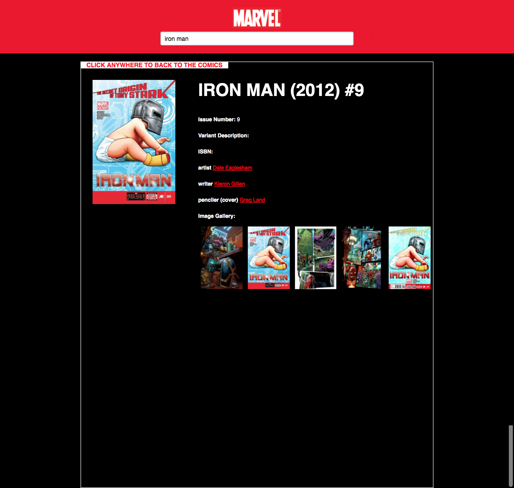

# React and Ruby on Rails application

## Introduction

 This React in frontend and Rails in backend application. It calls external Marvell comic books API in order to serach it.

 You can also vote a specific book. For the sake of simplicity, the database stores only one table with comic votes.

### Installation
#### Backend
  - `bundle install`

#### Frontend
- `cd frontend`
- `npm install`

### Database Configuration
  - `rake db:create`
  - `rake db:migrate`

### Running
`bundle exec rails s`

**Important**:
The `rails s` will also run `cd frontend && npm run build`.
Don't forget to install the frontend before run `bundle exec rails s`. The `npm run build` will copy static files to the `/public` folder.

## Screenshots

### Show a single comic book

